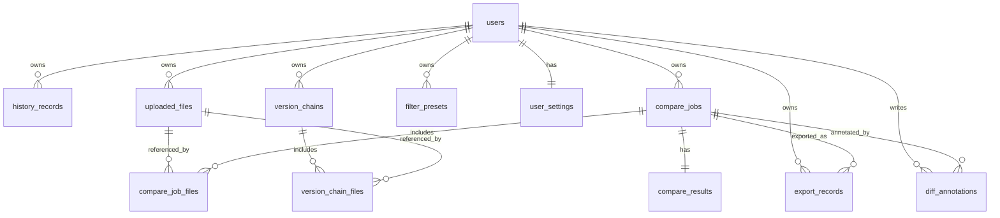

# 数据库结构设计说明

## 数据库设计目标
本系统后端采用 SQLite 作为本地关系型数据库。早期版本只包含 `users` 和 `history_records` 两张表，能够满足用户登录和简单历史记录保存，但无法完整表达上传文件、对比任务、导出审计、规则配置、差异备注和多版本分析等高级业务。升级后的数据库设计目标如下：

1. 保留旧功能兼容性：继续保留 `users` 和 `history_records`，旧历史记录接口不受影响。
2. 建立任务中心模型：通过 `compare_jobs`、`compare_job_files` 和 `compare_results` 保存一次对比的元信息、参与文件和完整结果。
3. 支撑可追溯工作流：通过 `uploaded_files` 和 `export_records` 记录文件来源、哈希、导出格式和导出时间。
4. 支撑用户个性化：通过 `filter_presets` 和 `user_settings` 保存用户常用规则和默认配置。
5. 支撑协作式结果复核：通过 `diff_annotations` 对单条差异添加备注、标签和处理状态。
6. 支撑多版本分析：通过 `version_chains` 和 `version_chain_files` 保存多版本连续对比的版本链和趋势信息。
7. 支撑统计分析：数据看板基于 `compare_jobs`、`compare_results`、`export_records` 和 `version_chains` 统计任务量、差异量、导出量和趋势。

## 为什么不再只有 users 和 history_records
`history_records` 的设计适合“保存一次完整结果并回放”的简单场景，但它将任务、文件、结果、规则和导出行为压缩在一个 JSON 字段中，存在三个问题：

- 查询能力弱：难以按文件类型、任务时间、导出行为、多版本趋势等维度统计。
- 关系表达弱：无法清晰表示一次任务包含哪些文件、一次导出属于哪个任务、某条备注属于哪个差异。
- 扩展成本高：新增规则预设、用户设置、差异备注和多版本链时，如果继续塞进历史 JSON，会导致数据冗余和接口耦合。

因此新设计保留 `history_records` 作为兼容层，同时新增独立业务表，形成面向任务中心和统计分析的数据库结构。

## 表关系说明
文字版关系如下：

- 一个 `users` 用户可以拥有多条 `history_records`、`uploaded_files`、`compare_jobs`、`export_records`、`filter_presets`、`diff_annotations` 和 `version_chains`。
- 一个 `users` 用户对应一条 `user_settings`。
- 一个 `compare_jobs` 对比任务可以关联多条 `compare_job_files`，并对应一条 `compare_results`。
- 一个 `compare_jobs` 对比任务可以产生多条 `export_records`，也可以拥有多条 `diff_annotations`。
- 一个 `uploaded_files` 文件记录可以被 `compare_job_files` 和 `version_chain_files` 引用；文件记录删除后，业务记录保留，引用字段置空。
- 一个 `version_chains` 版本链包含多条 `version_chain_files`。

## 字段说明

### users
用户账号表。

| 字段 | 类型 | 说明 |
| --- | --- | --- |
| id | INTEGER | 用户主键，自增 |
| username | TEXT | 用户名，唯一 |
| password_hash | TEXT | bcrypt 加密后的密码哈希 |
| created_at | TEXT | 创建时间 |

### history_records
旧版历史记录表，保留用于兼容原历史功能。

| 字段 | 类型 | 说明 |
| --- | --- | --- |
| id | INTEGER | 历史记录主键，自增 |
| user_id | INTEGER | 所属用户 |
| file_type | TEXT | 文件类型 |
| left_file_name | TEXT | 左侧文件名 |
| right_file_name | TEXT | 右侧文件名 |
| summary | TEXT | 差异统计 JSON |
| filters | TEXT | 基础过滤配置 JSON |
| compare_result | TEXT | 完整对比响应 JSON |
| created_at | TEXT | 创建时间 |

### uploaded_files
文件元数据表。

| 字段 | 类型 | 说明 |
| --- | --- | --- |
| id | INTEGER | 文件记录主键，自增 |
| user_id | INTEGER | 所属用户 |
| original_name | TEXT | 原始文件名 |
| stored_name | TEXT | 服务端存储名，可为空 |
| file_type | TEXT | 识别后的文件类型 |
| mime_type | TEXT | MIME 类型 |
| size_bytes | INTEGER | 文件大小 |
| sha256 | TEXT | SHA-256 哈希 |
| storage_path | TEXT | 后端存储路径 |
| source_type | TEXT | 来源，例如 upload、compare-upload、version-compare-upload |
| created_at | TEXT | 创建时间 |

### compare_jobs
对比任务主表。

| 字段 | 类型 | 说明 |
| --- | --- | --- |
| id | INTEGER | 任务主键，自增 |
| user_id | INTEGER | 所属用户 |
| title | TEXT | 任务标题 |
| file_type | TEXT | 文件类型 |
| input_mode | TEXT | 输入模式，pair 或 versions |
| status | TEXT | 任务状态 |
| algorithm | TEXT | 对比算法 |
| duration_ms | INTEGER | 任务耗时 |
| result_count | INTEGER | 差异数量 |
| result_truncated | INTEGER | 是否截断，0/1 |
| created_at | TEXT | 创建时间 |
| updated_at | TEXT | 更新时间 |

### compare_job_files
任务文件关联表。

| 字段 | 类型 | 说明 |
| --- | --- | --- |
| id | INTEGER | 主键，自增 |
| job_id | INTEGER | 所属任务 |
| file_id | INTEGER | 关联上传文件，可为空 |
| role | TEXT | 文件角色，left、right、version |
| version_index | INTEGER | 多版本序号 |
| display_name | TEXT | 展示名称 |
| created_at | TEXT | 创建时间 |

### compare_results
任务结果表，与 `compare_jobs` 一对一。

| 字段 | 类型 | 说明 |
| --- | --- | --- |
| id | INTEGER | 主键，自增 |
| job_id | INTEGER | 所属任务，唯一 |
| summary | TEXT | 差异统计 JSON |
| filters | TEXT | 基础过滤 JSON |
| advanced_rules | TEXT | 高级规则 JSON |
| normalization | TEXT | 归一化配置 JSON |
| performance | TEXT | 性能信息 JSON |
| result_json | TEXT | 完整差异结果 JSON |
| received | TEXT | 请求摘要 JSON |
| created_at | TEXT | 创建时间 |

### export_records
导出审计记录表。

| 字段 | 类型 | 说明 |
| --- | --- | --- |
| id | INTEGER | 导出记录主键，自增 |
| user_id | INTEGER | 所属用户 |
| job_id | INTEGER | 所属任务，可为空 |
| export_type | TEXT | 导出类型，html 或 pdf |
| file_name | TEXT | 导出文件名 |
| options | TEXT | 导出选项 JSON |
| created_at | TEXT | 导出时间 |

### filter_presets
筛选规则预设表。

| 字段 | 类型 | 说明 |
| --- | --- | --- |
| id | INTEGER | 预设主键，自增 |
| user_id | INTEGER | 所属用户 |
| name | TEXT | 预设名称 |
| description | TEXT | 预设说明 |
| file_type | TEXT | 适用文件类型 |
| filters | TEXT | 基础过滤 JSON |
| advanced_rules | TEXT | 高级规则 JSON |
| normalization | TEXT | 归一化配置 JSON |
| is_default | INTEGER | 是否默认，0/1 |
| created_at | TEXT | 创建时间 |
| updated_at | TEXT | 更新时间 |

### user_settings
用户默认设置表。

| 字段 | 类型 | 说明 |
| --- | --- | --- |
| user_id | INTEGER | 用户主键，同时为本表主键 |
| default_file_type | TEXT | 默认文件类型 |
| default_filters | TEXT | 默认基础过滤 JSON |
| default_advanced_rules | TEXT | 默认高级规则 JSON |
| default_normalization | TEXT | 默认归一化配置 JSON |
| theme | TEXT | 主题，light 或 dark |
| created_at | TEXT | 创建时间 |
| updated_at | TEXT | 更新时间 |

### diff_annotations
差异备注与标记表。

| 字段 | 类型 | 说明 |
| --- | --- | --- |
| id | INTEGER | 备注主键，自增 |
| user_id | INTEGER | 所属用户 |
| job_id | INTEGER | 所属任务 |
| diff_id | TEXT | 差异项 ID |
| note | TEXT | 备注内容 |
| tag | TEXT | 标签 |
| resolved | INTEGER | 是否已处理，0/1 |
| created_at | TEXT | 创建时间 |
| updated_at | TEXT | 更新时间 |

### version_chains
多版本链主表。

| 字段 | 类型 | 说明 |
| --- | --- | --- |
| id | INTEGER | 版本链主键，自增 |
| user_id | INTEGER | 所属用户 |
| title | TEXT | 版本链标题 |
| file_type | TEXT | 文件类型 |
| summary | TEXT | 版本链摘要 JSON |
| trend | TEXT | 趋势摘要 JSON |
| created_at | TEXT | 创建时间 |

### version_chain_files
版本链文件明细表。

| 字段 | 类型 | 说明 |
| --- | --- | --- |
| id | INTEGER | 主键，自增 |
| chain_id | INTEGER | 所属版本链 |
| file_id | INTEGER | 关联上传文件，可为空 |
| version_index | INTEGER | 版本序号 |
| version_label | TEXT | 版本标签 |
| file_name | TEXT | 文件名 |
| created_at | TEXT | 创建时间 |

## 新数据库设计对功能的支撑
- 任务中心：`compare_jobs` 保存任务元信息，`compare_job_files` 保存参与文件，`compare_results` 保存完整结果。
- 导出记录：`export_records` 记录导出格式、文件名、任务归属和导出时间，可用于审计追踪。
- 规则预设：`filter_presets` 保存用户常用过滤、高级规则和归一化规则。
- 用户默认设置：`user_settings` 让用户进入对比页时自动加载默认配置。
- 差异备注：`diff_annotations` 以 `job_id + diff_id` 定位具体差异项，保存备注、标签和处理状态。
- 多版本分析：`version_chains` 保存版本链摘要，`version_chain_files` 保存每个版本文件，完整差异结果仍可通过关联任务恢复。
- 数据看板：`compare_jobs`、`compare_results`、`export_records`、`version_chains` 提供统计来源。

## 索引设计
| 索引 | 作用 |
| --- | --- |
| history_records(user_id, created_at DESC) | 按用户倒序加载历史记录 |
| uploaded_files(user_id, created_at DESC) | 按用户倒序加载文件记录 |
| compare_jobs(user_id, created_at DESC) | 按用户倒序加载任务中心 |
| compare_results(job_id) | 快速读取任务结果 |
| export_records(user_id, created_at DESC) | 按用户倒序加载导出记录 |
| filter_presets(user_id, file_type) | 按用户和类型筛选预设 |
| diff_annotations(user_id, job_id) | 快速读取某任务下备注 |
| version_chains(user_id, created_at DESC) | 按用户倒序加载版本链 |
