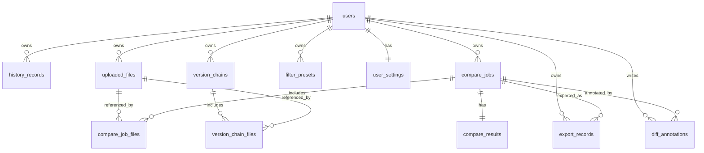

# 数据库结构说明

当前后端使用 SQLite 存储用户、历史记录、文件、对比任务和导出等数据。数据库初始化逻辑位于 `backend/src/services/database.service.ts`，所有表均使用 `CREATE TABLE IF NOT EXISTS` 创建，便于在保留已有数据的前提下逐步升级。

## 兼容性原则
- `users` 和 `history_records` 是已有核心表，继续保留，旧的历史记录接口仍然读取 `history_records.compare_result`。
- 新增表围绕更完整的对比任务模型设计，不替代旧历史记录表。
- 复杂配置、统计摘要和差异结果使用 JSON 字符串写入 `TEXT` 字段，便于保存前后端已有响应结构。
- 用户相关数据通过 `user_id` 关联到 `users.id`，用户删除时级联清理业务数据。

## 表清单

### users
用户账号表。

主要字段：
- `id`：用户主键。
- `username`：唯一用户名。
- `password_hash`：bcrypt 哈希后的密码。
- `created_at`：创建时间。

关系：
- 被 `history_records`、`uploaded_files`、`compare_jobs`、`export_records`、`filter_presets`、`user_settings`、`diff_annotations`、`version_chains` 引用。

### history_records
旧版历史记录表，用于继续支持现有历史记录功能。

主要字段：
- `user_id`：所属用户。
- `file_type`：对比文件类型。
- `left_file_name`、`right_file_name`：左右两侧文件名或文本输入标识。
- `summary`：差异统计 JSON 字符串。
- `filters`：过滤配置 JSON 字符串。
- `compare_result`：完整对比响应 JSON 字符串。
- `created_at`：创建时间。

关系：
- `user_id` 关联 `users.id`，用户删除时级联删除。

### uploaded_files
上传文件或文本输入转存文件的元数据表。

主要字段：
- `user_id`：所属用户。
- `original_name`：用户上传时的原始文件名。
- `stored_name`：服务端存储文件名。
- `file_type`：识别后的业务文件类型。
- `mime_type`：上传 MIME 类型。
- `size_bytes`：文件大小。
- `sha256`：内容哈希，用于去重或校验。
- `storage_path`：文件在服务端的存储路径。
- `source_type`：来源类型，默认 `upload`，可扩展为文本输入、导入等。
- `created_at`：创建时间。

关系：
- `user_id` 关联 `users.id`。
- 被 `compare_job_files.file_id` 和 `version_chain_files.file_id` 引用；文件记录删除后，引用处保留业务记录并将 `file_id` 置空。

### compare_jobs
一次对比任务的主表，适用于双文件对比和多版本对比。

主要字段：
- `user_id`：所属用户。
- `title`：任务标题。
- `file_type`：对比文件类型。
- `input_mode`：输入模式，默认 `pair`，可扩展为多版本模式。
- `status`：任务状态，默认 `completed`。
- `algorithm`：使用的对比算法。
- `duration_ms`：耗时毫秒数。
- `result_count`：结果数量。
- `result_truncated`：结果是否被截断，使用 0/1 存储布尔值。
- `created_at`、`updated_at`：创建和更新时间。

关系：
- `user_id` 关联 `users.id`。
- 被 `compare_job_files`、`compare_results`、`export_records`、`diff_annotations` 引用。

### compare_job_files
对比任务与参与文件之间的关联表。

主要字段：
- `job_id`：所属对比任务。
- `file_id`：关联的上传文件，可为空。
- `role`：文件角色，例如 `left`、`right` 或 `version`。
- `version_index`：多版本对比中的版本顺序。
- `display_name`：界面展示名称。
- `created_at`：创建时间。

关系：
- `job_id` 关联 `compare_jobs.id`，任务删除时级联删除。
- `file_id` 关联 `uploaded_files.id`，文件删除时置空。

### compare_results
对比任务结果表，与 `compare_jobs` 一对一。

主要字段：
- `job_id`：所属任务，唯一。
- `summary`：差异统计 JSON 字符串。
- `filters`：基础过滤配置 JSON 字符串。
- `advanced_rules`：高级规则配置和命中信息 JSON 字符串。
- `normalization`：归一化配置和命中信息 JSON 字符串。
- `performance`：性能信息 JSON 字符串。
- `result_json`：完整差异结果 JSON 字符串。
- `received`：请求输入摘要 JSON 字符串。
- `created_at`：创建时间。

关系：
- `job_id` 关联 `compare_jobs.id`，任务删除时级联删除。

### export_records
导出记录表，用于记录 HTML、PDF 等导出行为。

主要字段：
- `user_id`：所属用户。
- `job_id`：来源对比任务，可为空。
- `export_type`：导出类型，例如 `html` 或 `pdf`。
- `file_name`：生成的导出文件名。
- `options`：导出选项 JSON 字符串。
- `created_at`：创建时间。

关系：
- `user_id` 关联 `users.id`。
- `job_id` 关联 `compare_jobs.id`，任务删除时置空。

### filter_presets
用户保存的过滤和对比规则预设。

主要字段：
- `user_id`：所属用户。
- `name`：预设名称。
- `description`：预设说明。
- `file_type`：适用文件类型，默认 `auto`。
- `filters`：基础过滤配置 JSON 字符串。
- `advanced_rules`：高级规则配置 JSON 字符串。
- `normalization`：归一化配置 JSON 字符串。
- `is_default`：是否默认预设，使用 0/1 存储布尔值。
- `created_at`、`updated_at`：创建和更新时间。

关系：
- `user_id` 关联 `users.id`。

### user_settings
用户级默认设置表，与 `users` 一对一。

主要字段：
- `user_id`：用户主键，同时也是本表主键。
- `default_file_type`：默认文件类型，默认 `auto`。
- `default_filters`：默认基础过滤配置 JSON 字符串。
- `default_advanced_rules`：默认高级规则配置 JSON 字符串。
- `default_normalization`：默认归一化配置 JSON 字符串。
- `theme`：界面主题，默认 `light`。
- `created_at`、`updated_at`：创建和更新时间。

关系：
- `user_id` 关联 `users.id`，用户删除时级联删除。

### diff_annotations
差异项批注表，用于对单个差异项写备注、标记和处理状态。

主要字段：
- `user_id`：所属用户。
- `job_id`：所属对比任务。
- `diff_id`：差异项稳定 ID，对应接口结果中的 `meta.diffId`。
- `note`：批注内容。
- `tag`：可选标签。
- `resolved`：是否已处理，使用 0/1 存储布尔值。
- `created_at`、`updated_at`：创建和更新时间。

关系：
- `user_id` 关联 `users.id`。
- `job_id` 关联 `compare_jobs.id`，任务删除时级联删除。

### version_chains
多版本对比链主表。

主要字段：
- `user_id`：所属用户。
- `title`：版本链标题。
- `file_type`：文件类型。
- `summary`：整体差异统计 JSON 字符串。
- `trend`：趋势摘要 JSON 字符串。
- `created_at`：创建时间。

关系：
- `user_id` 关联 `users.id`。
- 被 `version_chain_files.chain_id` 引用。

### version_chain_files
多版本对比链中的版本文件表。

主要字段：
- `chain_id`：所属版本链。
- `file_id`：关联上传文件，可为空。
- `version_index`：版本顺序。
- `version_label`：版本标签。
- `file_name`：版本文件名。
- `created_at`：创建时间。

关系：
- `chain_id` 关联 `version_chains.id`，版本链删除时级联删除。
- `file_id` 关联 `uploaded_files.id`，文件删除时置空。

## 主要关系

## 索引
- `history_records(user_id, created_at DESC)`：按用户倒序加载旧历史记录。
- `uploaded_files(user_id, created_at DESC)`：按用户倒序加载上传文件。
- `compare_jobs(user_id, created_at DESC)`：按用户倒序加载对比任务。
- `compare_results(job_id)`：通过任务快速读取结果。
- `export_records(user_id, created_at DESC)`：按用户倒序加载导出记录。
- `filter_presets(user_id, file_type)`：按用户和文件类型筛选预设。
- `diff_annotations(user_id, job_id)`：读取某个用户在某次任务下的批注。
- `version_chains(user_id, created_at DESC)`：按用户倒序加载多版本对比链。
